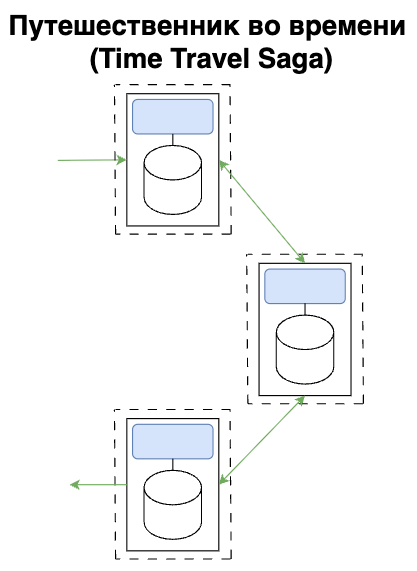

# Паттерны транзакционных саг

В монолитных системах, как правило, используется одна реляционная база данных, и транзакции поддерживают свойства ACID (атомарность, согласованность, изоляция, долговременность). Это обеспечивает высокую надежность и строгую согласованность данных, что является ключевым преимуществом такой архитектуры.

Распределенные транзакции не поддерживают свойства ACID, но поддерживают так называемые свойства BASE:
1. BA (Basic Availability) - базовая доступность (Сервисы принимающие участие в распределенной транзакции должны быть готовы обрабатывать запросы).
2. S (Soft State) - Уязвимое состояние (Состояние, когда распределенная транзакция еще выполняется и бизнес запрос еще не зафиксирован).
3. E (Eventual Consistency) - Согласованность в конечном итоге. (Через некоторое время все все участники бизнес-процесс придут к согласованному состоянию).

Транзакционные саги представляют собой комбинации трех сил (взаимодействия, согласованность, координация).

| Паттерн                                       | Взаимодействия | Согласованность | Координация  |
|-----------------------------------------------|----------------|-----------------|--------------|
| Эпическая сага (Epic Saga) САО                | Синхронные     | Атомарная       | Оркестрация  |
| Переписка (Phone Tag Saga) САХ                | Синхронные     | Атомарная       | Хореография  |
| Сказка (Fairy Tale Saga) СПО                  | Синхронные     | Потенциальная   | Оркестрация  |
| Путешествие во времени (Time Travel Saga) СПХ | Синхронные     | Потенциальная   | Хореография  |
| Фантастика (Fantasy Fiction Saga) ААО         | Асинхронные    | Атомарная       | Оркестрация  |
| Ужасы (Horror Story) ААХ                      | Асинхронные    | Атомарная       | Хореография  |
| Параллельная сага (Parallel Saga) АПО         | Асинхронные    | Потенциальная   | Оркестрация  |
| Антология (Anthology Saga) АПХ                | Асинхронные    | Потенциальная   | Хореография  |

### Сильные стороны паттернов

### Эпическая сага (Epic Saga) САО

<b>Описание:</b> Паттерн Эпическая сага (Epic Saga) является "традиционным паттерном",
который понимают многие архитекторы под сагой оркестрацией. Данный паттерн имитирует поведение монолитной системы.

Сервис оркестратора организует рабочий процесс для взаимодействия между сервисами. Бизнес-процесс будет выполняться
транзакционно - либо все изменения будут применены успешно, либо не будет применено ничего.

Паттерн широко используется на практике.

<b>Сильная сторона:</b> Атомарность транзакции (все или ничего) и сложные процессы. Приближенное поведение как в монолитной системе.

<b>Слабая сторона:</b> Очень низкая масштабирумость/адаптируемость. Низкая отзывчивость/доступность.

### Оценка характеристик паттерна

| Паттерн Эпическая сага (Epic Sag) | Характеристика |
|-----------------------------------|----------------|
| Взаимодействия                    | Синхронные     |
| Согласованность                   | Атомарная      |
| Координация                       | Оркестрация    |
| Связанность                       | Очень высокая  |
| Сложность                         | Низкая         |
| Отзывчивость/доступность          | Низкая         |
| Масштабируемость/адаптируемость   | Очень низкая   |

#### Схема взаимодействий

### Переписка (Phone Tag Saga) САХ

<b>Описание:</b> Паттерн Переписка (Phone Tag Saga) получил свое название, поскольку
напоминает известную детскую игру Испорченный телефон: дети становятся в круг, и первый
ребенок шепчет на ухо секрет следующему ребенку, тот шепотом передает его следующему,
и так до тех пор, пока не замкнется круг. Последний участник произносит услышанное в слух.

Каждый сервис должен иметь встроенную логику, позволяющую отправлять компенсирующие запросы
обратно по цепочке в случае ошибки. Сервисы должны содержать дополнительно контекст рабочего процесса, включая
маршрутизацию.

<b>Сильная сторона:</b> Атомарность транзакции (все или ничего) и простые процессы.

<b>Слабая сторона:</b> Низкая масштабирумость/адаптируемость. Низкая отзывчивость/доступность. Сложная логика обработки ошибок.

#### Схема взаимодействий

### Оценка характеристик паттерна

| Паттерн Переписка (Phone Tag Saga) | Характеристика |   |
|------------------------------------|----------------|---|
| Взаимодействия                     | Синхронные     |   |
| Согласованность                    | Атомарная      |   |
| Координация                        | Хореография    |   |
| Связанность                        | Высокая        |   |
| Сложность                          | Высокая        |   |
| Отзывчивость/доступность           | Низкая         |   |
| Масштабируемость/адаптируемость    | Низкая         |   |

### Сказка (Fairy Tale Saga) СПО

<b>Описание:</b> Чаще всего в сказках рассказываются веселые истории с простыми сюжетами. Паттерн
Сказка (Fairy Tale Saga) именно поэтому получил такое название.

В паттерне существует оркестратор, который координирует запросы, ответы и обработку ошибок. Но ответственность
за обработку транзакций возлагается не на оркестратор, а на каждый предметный сервис в отдельности.

<b>Сильная сторона:</b> Хорошая производительность и сложные сценарии.

#### Схема взаимодействий

### Оценка характеристик паттерна

| Паттерн Сказка (Fairy Tale Saga) | Характеристика |
|----------------------------------|----------------|
| Взаимодействия                   | Синхронные     |
| Согласованность                  | Потенциальная  |
| Координация                      | Оркестрация    |
| Связанность                      | Высокая        |
| Сложность                        | Очень низкая   |
| Отзывчивость/доступность         | Средняя        |
| Масштабируемость/адаптируемость  | Высокая        |

### Путешествие во времени (Time Travel Saga) СПХ

<b>Описание:</b> В паттерне Путешествие во времени (Time Travel Saga) каждый сервис принимает запрос,
выполняет действие и передает запрос другому сервису. Сага очень похожа на паттерн проектирования
"Цепочка ответственности" (Chain of Responsibility) и на архитектурный стиль "Каналы и фильтры" (Pipes ans Filters).

<b>Сильная сторона:</b> Хорошая производительность и простые сценарии.

<b>Слабая сторона:</b> Сложность обработки ошибок, каждый сервис должен содержать дополнительно бизнес-контекст
и логику обработки ошибок.

#### Схема взаимодействий

### Оценка характеристик паттерна

| Паттерн Путешественник во времени (Time Travel Saga) | Характеристика |
|------------------------------------------------------|----------------|
| Взаимодействия                                       | Синхронные     |
| Согласованность                                      | Потенциальная  |
| Координация                                          | Хореография    |
| Связанность                                          | Средняя        |
| Сложность                                            | Низкая         |
| Отзывчивость/доступность                             | Средняя        |
| Масштабируемость/адаптируемость                      | Высокая        |

### Фантастика (Fantasy Fiction Saga) ААО

<b>Описание:</b> Паттерн Фантастика (Fantasy Fiction Saga) добавляет асинхронности к оркестрации. Не можем полагаться
на порядок действий и это увеличивает вероятность взаимоблокировок, появления состояния гонки и множество других проблем,
свойственным распределенным системам.

<b>Слабая сторона:</b> Высокая сложность (реализации, поддержки, тестирования, дебагинга). Проблемы распределенных систем (взаимоблокировки, состояния гонки, неопределенная очередность).

#### Схема взаимодействий

### Оценка характеристик паттерна

| Паттерн Фантастика (Fantasy Fiction Saga) | Характеристика |
|-------------------------------------------|----------------|
| Взаимодействия                            | Асинхронные    |
| Согласованность                           | Атомарная      |
| Координация                               | Оркестрация    |
| Связанность                               | Высокая        |
| Сложность                                 | Высокая        |
| Отзывчивость/доступность                  | Низкая         |
| Масштабируемость/адаптируемость           | Низкая         |

### Ужасы (Horror Story) ААХ

<b>Описание:</b> Ужасы (Horror Story) является антипаттерном. Название говорит само за себя - Ужасы, которые
стоит избегать. Худшая комбинация характеристик из все саг.

<b>Слабая сторона:</b> Высокая сложность (реализации, поддержки, тестирования, дебагинга). Проблемы распределенных систем (взаимоблокировки, состояния гонки, неопределенная очередность). Низкий уровень отклика.

#### Схема взаимодействий

### Оценка характеристик паттерна

| Паттерн Фантастика (Fantasy Fiction Saga) | Характеристика |
|-------------------------------------------|----------------|
| Взаимодействия                            | Асинхронные    |
| Согласованность                           | Атомарная      |
| Координация                               | Хореография    |
| Связанность                               | Средняя        |
| Сложность                                 | Высокая        |
| Отзывчивость/доступность                  | Низкая         |
| Масштабируемость/адаптируемость           | Средняя        |

### Параллельная сага (Parallel Saga) АПО

<b>Описание:</b> Паттерн Параллельная сага (Parallel Saga) использует посредника, что делает его подходящим для
реализации сложных рабочих процессов.

<b>Сильная сторона:</b> Высокая производительность и сложные сценарии.

<b>Слабая сторона:</b> Проблемы распределенных систем (взаимоблокировки, состояния гонки, неопределенная очередность).

#### Схема взаимодействий

### Оценка характеристик паттерна

| Паттерн Параллельная сага (Parallel Saga) | Характеристика |
|-------------------------------------------|----------------|
| Взаимодействия                            | Асинхронные    |
| Согласованность                           | Потенциальная  |
| Координация                               | Оркестрация    |
| Связанность                               | Низкая         |
| Сложность                                 | Низкая         |
| Отзывчивость/доступность                  | Высокая        |
| Масштабируемость/адаптируемость           | Высокая        |

### Антология сага (Anthology Saga) АПХ

<b>Описание:</b> Паттерн Антология (Anthology Saga) является самый высокопроизводительным и наименее связанным паттерном.
Если нужна максимальная производительность и рабочие процессы простые и требуют простую обработку ошибок, тогда этот
паттерн станет лучшим решением.

<b>Сильная сторона:</b> Высокая производительность и простые сценарии.

<b>Слабая сторона:</b> Проблемы распределенных систем (взаимоблокировки, состояния гонки, неопределенная очередность). Высокая сложность (реализации, поддержки, тестирования, дебагинга).

#### Схема взаимодействий

### Оценка характеристик паттерна

| Паттерн Антология (Anthology Saga) | Характеристика |
|------------------------------------|----------------|
| Взаимодействия                     | Асинхронные    |
| Согласованность                    | Потенциальная  |
| Координация                        | Хореография    |
| Связанность                        | Очень низкая   |
| Сложность                          | Высокая        |
| Отзывчивость/доступность           | Высокая        |
| Масштабируемость/адаптируемость    | Очень высокая  |